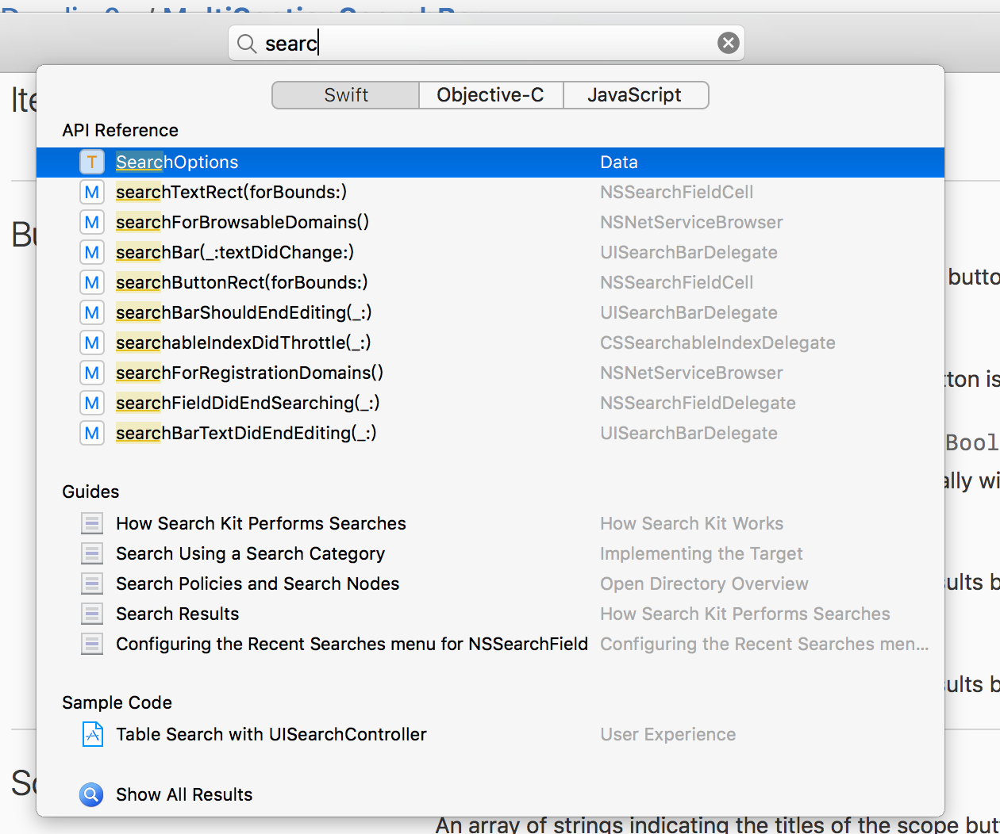

# MultiSectionSearchBar

##Goal:

 

 ##Usage:

      let searchBar = CustomSearchView.init(frame:CGRect.zero,placeHolder:"PlaceHolder")

      searchBar.searchButtonClicked = {
          str in 
          #Do something about data search#
      }
      //After search, call func:
      searchBar.updateSearchMenuData(dataArray:,titleArray:)
      
      searchBar.searchResultClicked = {
          (titleIndex,dataIndex) in 
          #Do something when search result being selected#
      }

      //If need search when every char inputs
      isNeedSearchWhileInputing = true

 Current:
Ready to use~
 
 TO DO:
 Optimize Code and UI.
